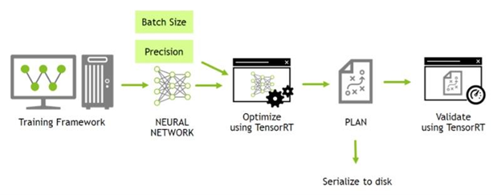

<font color="#76b900" size="3">**摘要**</font>

本 NVIDIA TensorRT 8.4.3 快速入门指南是想要尝试 TensorRT SDK 的开发人员的起点；具体来说，本文演示了如何快速构造应用程序，以便在 TensorRT 引擎上运行推断。

确保您熟悉 [<font color="#76b900">NVIDIA TensorRT 发行说明</font>](发行说明.md)，了解最新的新功能和已知问题。

有关先前发布的 TensorRT 安装文档，请参阅[<font color="#76b900"> TensorRT 档案。</font>](档案.md)
## <font color="#76b900">1.介绍</font>

TensorRT ™ 是 NVIDIA® 的一个 SDK ，用于优化经过训练的深度学习模型，以实现高性能推理。 TensorRT 包含一个用于训练深度学习模型的深度学习推理优化器，以及用于执行的 runtime 。

在您选择的框架中训练您的深度学习模型后， TensorRT 使您能够以更高的吞吐量和更低的延迟运行它。 

图1.使用 TensorRT 的深度学习开发一般流程



本指南涵盖了 TensorRT 中可用的基本安装、转换和运行时选项，以及它们的最佳时间。

下面是每个章节的概要总结

- **[<font color="#76b900">安装 TensorRT </font>](#Install)**

    提供了多种简单的安装TensorRT的方法

- **[<font color="#76b900">TensorRT 生态</font>](#Ecosystem)**

    描述了一个简单的流程图，以显示不同类型的转换和部署工作流，并讨论其缺点。

- **[<font color="#76b900">使用 ONNX 的部署示例</font>](#ONNX)**

    研究转换和部署模型的基本步骤。它将介绍本指南其余部分中的使用概念，并指导您完成优化推理执行所必须做出的决策

- **[<font color="#76b900">TF-TRT 框架集成</font>](#TF-TRT)**

    在Google ® TensorFlow (TF) 中引入了TensorRT (TRT)

- **[<font color="#76b900">ONNX 转换和部署</font>](#ONNX-T-D)**

    提供了TensorFlow和Pytorch的ONNX导出概述，以及详细的Jupyter

- **[<font color="#76b900">使用 TensorRT Runtime API</font>](#Runtime-Api)**

    提供了一个教程演示使用 TensorRT C++ 和 Python API 对图像进行语义分割。

关于快速部署模型的高级应用程序，请阅读[<font color="#76b900"> NVIDIA Triton™ 推理服务器快速构建</font>](https://github.com/triton-inference-server/server/blob/r20.12/docs/quickstart.md)。

## <h2 id="Install"><font color="#76b900">2.安装TensorRT的方法</font></h2>

- 容器安装

- Debian文件安装

- 仅从 `pip` wheel 文件安装

关于TensorRT的其他方法请阅读[<font color="#76b900">NVIDIA TensorRT安装指南</font>](安装指南.md)。

对于已经熟悉 TensorRT 并希望快速运行其应用程序、正在使用包含 cuDNN 的 NVIDIA CUDA ® 容器或希望设置自动化的高级用户，请按照网络安装说明进行操作（请阅读[<font color="#76b900">使用 NVIDIA 机器学习网络进行 Debian 安装</font>](安装指南.md)）。

### <font color="#76b900">2.1. 容器安装</font>

本节介绍 NVIDIA 定期发布和维护的定制虚拟机映像（VMI）。NVIDIA NGC 公司 是一家经认证的公共云平台，用户可以访问有关如何浏览 [<font color="#76b900">NGC网站</font>](https://catalog.ngc.nvidia.com/) 和标识可用NGC容器和标记以在其VMI上运行的特定设置说明。
在每个云提供商上，NVIDIA 发布定制的 GPU 优化虚拟机映像（VMI），并定期更新操作系统和驱动程序。这些 VMI 针对最新一代 NVIDIA GPU 的性能进行了优化。使用这些 VMI 在具有 A100、V100 或 T4 GPU 的云托管虚拟机实例上部署NGC托管的容器、模型和资源，可确保深度学习、机器学习和 HPC 工作负载的最佳性能。
要在公共云上部署 TensorRT 容器，请遵循[<font color="#76b900"> NGC 认证的公共云平台相关的步骤</font>](https://docs.nvidia.com/ngc/ngc-deploy-public-cloud/index.html)。

### <font color="#76b900">2.2. Debian 安装</font>

本节包含开发人员安装说明。此安装方法适用于新用户或希望完整安装的开发人员用户，包括 C++ 和 Python API 的示例和文档。

<font color="#76b900" size="3">**关于此任务**</font>

对于已经熟悉 TensorRT 并希望快速运行其应用程序、正在使用包含 cuDNN 的 NVIDIA CUDA ® 容器或希望设置自动化的高级用户，请按照网络安装说明进行操作（请阅读[<font color="#76b900">使用 NVIDIA 机器学习网络进行 Debian 安装</font>](安装指南.md)）。

> 注：
> 
> - 以下命令是 amd64 的示例，对于 arm64 这些命令是相同的
> 
> - 使用此方法安装 Python 包时，必须使用 pip 手动安装依赖项

<font color="#76b900" size="3">**步骤**</font>

1. [<font color="#76b900">下载</font>]()与您正在使用的 Ubuntu 版本和 CPU 架构相匹配的 TensorRT 本地 Repo 文件
2. 从 Debian 本地 Repo 包安装 TensorTR 。替换`ubuntuxx04`, `cudax.x`, `trt8.x.x.x` 和 `yyyymmdd`。也就是您的特定操作系统版本、CUDA版本、TensorRT版本和软件包日期。

```shell
os="ubuntuxx04"
tag="cudax.x-trt8.x.x.x-ga-yyyymmdd"
sudo dpkg -i nv-tensorrt-repo-${os}-${tag}_1-1_amd64.deb
sudo apt-key add /var/nv-tensorrt-repo-${os}-${tag}/*.pub

sudo apt-get update
sudo apt-get install tensorrt
```

如果使用的是 Python 3.x :

```shell
python3 -m pip install numpy
sudo apt-get install python3-libnvinfer-dev
```

将安装以下附加软件包

```shell
python3-libnvinfer
```

如果您计划将 TensorRT 与 TensorFlow 结合使用：

```shell
python3 -m pip install protobuf
sudo apt-get install uff-converter-tf
```

`graphsurgeon-tf` 包也将与前面的命令一起安装。

如果您想运行需要 ONNX `graphsurgeon` 示例，或将 Python 模块用于自己的项目，请运行

```shell
python3 -m pip install numpy onnx
sudo apt-get install onnx-graphsurgeon
```

3. 验证安装

```shell
dpkg -l | grep TensorRT
```

您应该看到类似以下内容：

```text
ii  graphsurgeon-tf	8.4.3-1+cuda11.6	amd64	GraphSurgeon for TensorRT package
ii  libnvinfer-bin		8.4.3-1+cuda11.6	amd64	TensorRT binaries
ii  libnvinfer-dev		8.4.3-1+cuda11.6	amd64	TensorRT development libraries and headers
ii  libnvinfer-plugin-dev	8.4.3-1+cuda11.6	amd64	TensorRT plugin libraries
ii  libnvinfer-plugin8	8.4.3-1+cuda11.6	amd64	TensorRT plugin libraries
ii  libnvinfer-samples	8.4.3-1+cuda11.6	all	TensorRT samples
ii  libnvinfer8		8.4.3-1+cuda11.6	amd64	TensorRT runtime libraries
ii  libnvonnxparsers-dev		8.4.3-1+cuda11.6	amd64	TensorRT ONNX libraries
ii  libnvonnxparsers8	8.4.3-1+cuda11.6	amd64	TensorRT ONNX libraries
ii  libnvparsers-dev	8.4.3-1+cuda11.6	amd64	TensorRT parsers libraries
ii  libnvparsers8	8.4.3-1+cuda11.6	amd64	TensorRT parsers libraries
ii  python3-libnvinfer	8.4.3-1+cuda11.6	amd64	Python 3 bindings for TensorRT
ii  python3-libnvinfer-dev	8.4.3-1+cuda11.6	amd64	Python 3 development package for TensorRT
ii  tensorrt		8.4.3.x-1+cuda11.6 	amd64	Meta package of TensorRT
ii  uff-converter-tf	8.4.3-1+cuda11.6	amd64	UFF converter for TensorRT package
ii  onnx-graphsurgeon   8.4.3-1+cuda11.6  amd64 ONNX GraphSurgeon for TensorRT package
```

### <font color="#76b900">2.3. pip Wheel 文件安装</font>

本节包含 仅从 pip [<font color="#76b900">wheel 文件</font>](https://pip.pypa.io/en/stable/reference/pip_wheel/)安装 TensorRT 的说明

<font color="#76b900" size="3">**关于此任务**</font>

>注：虽然 TensorTR 包也包含 pip Wheel 文件，但这些 Wheel 文件需要安装 `.deb` 或 `.rpm` 包的其余部分，并不能单独工作，`pip` 安装的 TensorRT Wheel 文件的不同之处在于，它是完全独立的和可安装的，不在需要 `.deb` 或 `.rpm` 文件。

`pip` 可安装的 `nvidia tensorrt` Python wheel 文件仅支持 Python3.6 到 3.10 和 CUDA 11.x 版本，不适用于其他 Python 或 CUDA 版本。当前仅支持 Linux 操作系统和 x86_64 体系结构 CPU 。这些 wheel 文件预计可以在 CentOS 7 或更新版本以及 Ubuntu 18.04 或更新版本上运行。

>注：如果您没有 root 访问权限，那么您是在 Python 虚拟环境之外运行的，或者出于任何其他原因。如果您希望用户安装，请将 `--user` 附加 `pip` 命令中


<h2 id="Ecosystem">TensorRT生态</h2>


<h2 id="ONNX">使用ONNX的部署示例</h2>

<h2 id="TF-TRT">TF-TRT框架集成</h2>

<h2 id="ONNX-T-D">ONNX转换和部署</h2>

<h2 id="Runtime-Api">使用TensorRT Runtime API</h2>