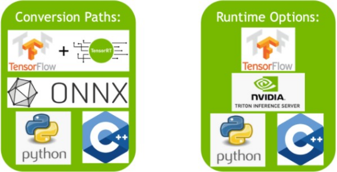

<font color="#76b900" size="3">**摘要**</font>

本 NVIDIA TensorRT 8.4.3 快速入门指南是想要尝试 TensorRT SDK 的开发人员的起点；具体来说，本文演示了如何快速构造应用程序，以便在 TensorRT 引擎上运行推断。

确保您熟悉 [<font color="#76b900">NVIDIA TensorRT 发行说明</font>](发行说明.md)，了解最新的新功能和已知问题。

有关先前发布的 TensorRT 安装文档，请参阅[<font color="#76b900"> TensorRT 档案。</font>](档案.md)
## <font color="#76b900">1. 介绍</font>

TensorRT ™ 是 NVIDIA® 的一个 SDK ，用于优化经过训练的深度学习模型，以实现高性能推理。 TensorRT 包含一个用于训练深度学习模型的深度学习推理优化器，以及用于执行的 runtime 。

在您选择的框架中训练您的深度学习模型后， TensorRT 使您能够以更高的吞吐量和更低的延迟运行它。 

图1. 使用 TensorRT 的深度学习开发一般流程

<center></center>

本指南涵盖了 TensorRT 中可用的基本安装、转换和运行时选项，以及它们的最佳时间。

下面是每个章节的概要总结

- **[<font color="#76b900">安装 TensorRT </font>](#Install)**

    提供了多种简单的安装TensorRT的方法

- **[<font color="#76b900">TensorRT 生态</font>](#Ecosystem)**

    描述了一个简单的流程图，以显示不同类型的转换和部署工作流，并讨论其缺点。

- **[<font color="#76b900">使用 ONNX 的部署示例</font>](#ONNX)**

    研究转换和部署模型的基本步骤。它将介绍本指南其余部分中的使用概念，并指导您完成优化推理执行所必须做出的决策

- **[<font color="#76b900">TF-TRT 框架集成</font>](#TF-TRT)**

    在Google ® TensorFlow (TF) 中引入了TensorRT (TRT)

- **[<font color="#76b900">ONNX 转换和部署</font>](#ONNX-T-D)**

    提供了TensorFlow和Pytorch的ONNX导出概述，以及详细的Jupyter

- **[<font color="#76b900">使用 TensorRT Runtime API</font>](#Runtime-Api)**

    提供了一个教程演示使用 TensorRT C++ 和 Python API 对图像进行语义分割。

关于快速部署模型的高级应用程序，请阅读[<font color="#76b900"> NVIDIA Triton™ 推理服务器快速构建</font>](https://github.com/triton-inference-server/server/blob/r20.12/docs/quickstart.md)。

## <h2 id="Install"><font color="#76b900">2. 安装TensorRT的方法</font></h2>

- 容器安装

- Debian文件安装

- 仅从 `pip` wheel 文件安装

关于TensorRT的其他方法请阅读[<font color="#76b900">NVIDIA TensorRT安装指南</font>](安装指南.md)。

对于已经熟悉 TensorRT 并希望快速运行其应用程序、正在使用包含 cuDNN 的 NVIDIA CUDA ® 容器或希望设置自动化的高级用户，请按照网络安装说明进行操作（请阅读[<font color="#76b900">使用 NVIDIA 机器学习网络进行 Debian 安装</font>](安装指南.md)）。

### <font color="#76b900">2.1. 容器安装</font>

本节介绍 NVIDIA 定期发布和维护的定制虚拟机映像（VMI）。NVIDIA NGC 公司 是一家经认证的公共云平台，用户可以访问有关如何浏览 [<font color="#76b900">NGC网站</font>](https://catalog.ngc.nvidia.com/) 和标识可用NGC容器和标记以在其VMI上运行的特定设置说明。
在每个云提供商上，NVIDIA 发布定制的 GPU 优化虚拟机映像（VMI），并定期更新操作系统和驱动程序。这些 VMI 针对最新一代 NVIDIA GPU 的性能进行了优化。使用这些 VMI 在具有 A100、V100 或 T4 GPU 的云托管虚拟机实例上部署NGC托管的容器、模型和资源，可确保深度学习、机器学习和 HPC 工作负载的最佳性能。
要在公共云上部署 TensorRT 容器，请遵循[<font color="#76b900"> NGC 认证的公共云平台相关的步骤</font>](https://docs.nvidia.com/ngc/ngc-deploy-public-cloud/index.html)。

### <font color="#76b900">2.2. Debian 安装</font>

本节包含开发人员安装说明。此安装方法适用于新用户或希望完整安装的开发人员用户，包括 C++ 和 Python API 的示例和文档。

<font color="#76b900" size="3">**关于此任务**</font>

对于已经熟悉 TensorRT 并希望快速运行其应用程序、正在使用包含 cuDNN 的 NVIDIA CUDA ® 容器或希望设置自动化的高级用户，请按照网络安装说明进行操作（请阅读[<font color="#76b900">使用 NVIDIA 机器学习网络进行 Debian 安装</font>](安装指南.md)）。

> 注：
> 
> - 以下命令是 amd64 的示例，对于 arm64 这些命令是相同的
> 
> - 使用此方法安装 Python 包时，必须使用 pip 手动安装依赖项

<font color="#76b900" size="3">**步骤**</font>

1. [<font color="#76b900">下载</font>]()与您正在使用的 Ubuntu 版本和 CPU 架构相匹配的 TensorRT 本地 Repo 文件
2. 从 Debian 本地 Repo 包安装 TensorTR 。替换`ubuntuxx04`, `cudax.x`, `trt8.x.x.x` 和 `yyyymmdd`。也就是您的特定操作系统版本、CUDA版本、TensorRT版本和软件包日期。

```shell
os="ubuntuxx04"
tag="cudax.x-trt8.x.x.x-ga-yyyymmdd"
sudo dpkg -i nv-tensorrt-repo-${os}-${tag}_1-1_amd64.deb
sudo apt-key add /var/nv-tensorrt-repo-${os}-${tag}/*.pub

sudo apt-get update
sudo apt-get install tensorrt
```

如果使用的是 Python 3.x :

```shell
python3 -m pip install numpy
sudo apt-get install python3-libnvinfer-dev
```

将安装以下附加软件包

```shell
python3-libnvinfer
```

如果您计划将 TensorRT 与 TensorFlow 结合使用：

```shell
python3 -m pip install protobuf
sudo apt-get install uff-converter-tf
```

`graphsurgeon-tf` 包也将与前面的命令一起安装。

如果您想运行需要 ONNX `graphsurgeon` 示例，或将 Python 模块用于自己的项目，请运行

```shell
python3 -m pip install numpy onnx
sudo apt-get install onnx-graphsurgeon
```

3. 验证安装

```shell
dpkg -l | grep TensorRT
```

您应该看到类似以下内容：

```text
ii  graphsurgeon-tf	8.4.3-1+cuda11.6	amd64	GraphSurgeon for TensorRT package
ii  libnvinfer-bin		8.4.3-1+cuda11.6	amd64	TensorRT binaries
ii  libnvinfer-dev		8.4.3-1+cuda11.6	amd64	TensorRT development libraries and headers
ii  libnvinfer-plugin-dev	8.4.3-1+cuda11.6	amd64	TensorRT plugin libraries
ii  libnvinfer-plugin8	8.4.3-1+cuda11.6	amd64	TensorRT plugin libraries
ii  libnvinfer-samples	8.4.3-1+cuda11.6	all	TensorRT samples
ii  libnvinfer8		8.4.3-1+cuda11.6	amd64	TensorRT runtime libraries
ii  libnvonnxparsers-dev		8.4.3-1+cuda11.6	amd64	TensorRT ONNX libraries
ii  libnvonnxparsers8	8.4.3-1+cuda11.6	amd64	TensorRT ONNX libraries
ii  libnvparsers-dev	8.4.3-1+cuda11.6	amd64	TensorRT parsers libraries
ii  libnvparsers8	8.4.3-1+cuda11.6	amd64	TensorRT parsers libraries
ii  python3-libnvinfer	8.4.3-1+cuda11.6	amd64	Python 3 bindings for TensorRT
ii  python3-libnvinfer-dev	8.4.3-1+cuda11.6	amd64	Python 3 development package for TensorRT
ii  tensorrt		8.4.3.x-1+cuda11.6 	amd64	Meta package of TensorRT
ii  uff-converter-tf	8.4.3-1+cuda11.6	amd64	UFF converter for TensorRT package
ii  onnx-graphsurgeon   8.4.3-1+cuda11.6  amd64 ONNX GraphSurgeon for TensorRT package
```

### <font color="#76b900">2.3. pip Wheel 文件安装</font>

本节包含 仅从 pip [<font color="#76b900">wheel 文件</font>](https://pip.pypa.io/en/stable/reference/pip_wheel/)安装 TensorRT 的说明

<font color="#76b900" size="3">**关于此任务**</font>

>注：虽然 TensorTR 包也包含 pip Wheel 文件，但这些 Wheel 文件需要安装 `.deb` 或 `.rpm` 包的其余部分，并不能单独工作，`pip` 安装的 TensorRT Wheel 文件的不同之处在于，它是完全独立的和可安装的，不在需要 `.deb` 或 `.rpm` 文件。

`pip` 可安装的 `nvidia tensorrt` Python wheel 文件仅支持 Python3.6 到 3.10 和 CUDA 11.x 版本，不适用于其他 Python 或 CUDA 版本。当前仅支持 Linux 操作系统和 x86_64 体系结构 CPU 。这些 wheel 文件预计可以在 CentOS 7 或更新版本以及 Ubuntu 18.04 或更新版本上运行。

>注：如果您没有 root 访问权限，那么您是在 Python 虚拟环境之外运行的，或者出于任何其他原因。如果您希望用户安装，请将 `--user` 附加 `pip` 命令中

<font color="#76b900" size="3">**开始之前**</font>

首先安装 `nvidia-pyindex` 包，这是设置 `pip` 安装以从 NGC 获取其他 Python 模块所必须的 ™ Pypi Reop

如果您的 `pip` 和 `setuptools` Python 模块已过时，请使用以下命令升级这些 Python 模块。如果这些 Python 模块已经过时，那么本节后面的命令可能会失败。

```shell
python3 -m pip install --upgrade setuptools pip
```

现在，您可以安装 `nvidia-pyindex` 模块。

```shell
python3 -m pip install nvidia-pyindex
```

如果您的项目正在使用 `requirements.txt` 文件，可以将下面条目添加到您的 `requirements.txt` 文件作为安装 ` nvidia-pyindex` 包的代替。

```shell
--extra-index-url https://pypi.ngc.nvidia.com
```

<font color="#76b900" size="3">**步骤**</font>

1. 安装 TensorRT Python wheel

    ```shell
    python3 -m pip install --upgrade nvidia-tensorrt
    ```

    前面的 `pip` 命令将拉取必需的 CUDA 库 和 cuDNN ，因为它们是 TensorRT Python wheel 的依赖。 如果您收到类似如下的 Python 异常形式的错误消息，则可能是 `nvidia-pyindex` 包未正确设置，或者您可能使用的是 3.6 到 3.10 以外的 Python 版本。

    ~~~shell
    ##################################################################
    The package you are trying to install is only a placeholder project on PyPI.org repository.
    This package is hosted on NVIDIA Python Package Index.
    
    This package can be installed as:
    ```
    $ pip install nvidia-pyindex
    $ pip install nvidia-tensorrt
    ```
    ##################################################################
    ~~~

2. 验证安装，请使用以下Python命令

    - 导入 `tensorrt Python` 模块。
    - 确认已安装正确版本的 TensorRT
    - 创建 `Builder` 对象验证 CUDA 安装是否正常

    ```shell
    python3
    >>> import tensorrt
    >>> print(tensorrt.__version__)
    >>> assert tensorrt.Builder(tensorrt.Logger())
    ```
   
    如果最后一个 Python 命令失败，并显示类似下面的错误消息，那么您可能没有安装NVIDIA驱动程序，或者NVIDIA驱动程序可能无法正常工作。如果你在一个容器中运行，试着从 `nvidia/cuda:x.y-base-<os>` 构建容器。

    ```shell
    [TensorRT] ERROR: CUDA initialization failure with error 100. Please check your CUDA installation: ...
    ```    
   
    如果前面的 Python 命令有效，那么您现在应该能够运行任何 TensorRT Python 示例，以进一步确认 TensorRT 安装是否有效。有关 TensorRT 示例的更多信息，请阅读 [<font color="#76b900">NVIDIA TensorRT样本支持指南</font>](示例支持指南.md)。

## <h2 id="Ecosystem"><font color="#76b900">3. TensorRT生态</font></h2>

TensorRT 是一个大型且灵活的项目。它可以处理各种转换和部署工作流，而哪种工作流最适合您将取决于您的特定用例和问题设置。
TensorRT 提供了几个部署选项，但所有工作流都涉及将模型转换为优化表示， TensorRT 将其称为引擎。为模型构建 TensorRT 工作流需要选择正确的部署选项，以及引擎创建的正确参数组合。

### <font color="#76b900">3.1. 基本TensorRT工作流程</font>

TensorRT 用户必须遵循五个基本步骤来转换和部署模型:

图2. 转换和部署模型的五个基本步骤

<center>
<svg
   width="643"
   height="640"
   version="1.1"
   id="svg752"
   sodipodi:docname="five-basic-steps.svg"
   inkscape:version="1.2.1 (9c6d41e410, 2022-07-14)"
   xmlns:inkscape="http://www.inkscape.org/namespaces/inkscape"
   xmlns:sodipodi="http://sodipodi.sourceforge.net/DTD/sodipodi-0.dtd"
   xmlns:xlink="http://www.w3.org/1999/xlink"
   xmlns="http://www.w3.org/2000/svg"
   xmlns:svg="http://www.w3.org/2000/svg">
  <defs
     id="defs756">
    <rect
       x="-18"
       y="4"
       width="183"
       height="139"
       id="rect583" />
    <marker
       style="overflow:visible"
       id="marker9295"
       refX="0"
       refY="0"
       orient="auto-start-reverse"
       inkscape:stockid="RoundedArrow"
       markerWidth="6.1347523"
       markerHeight="5.9304948"
       viewBox="0 0 6.1347524 5.9304951"
       inkscape:isstock="true"
       inkscape:collect="always"
       preserveAspectRatio="xMidYMid">
      <path
         transform="scale(0.7)"
         d="m -0.21114562,-4.1055728 6.42229122,3.21114561 a 1,1 90 0 1 0,1.78885438 L -0.21114562,4.1055728 A 1.236068,1.236068 31.717474 0 1 -2,3 v -6 a 1.236068,1.236068 148.28253 0 1 1.78885438,-1.1055728 z"
         style="fill:context-stroke;fill-rule:evenodd;stroke:none"
         id="path9293" />
    </marker>
    <marker
       style="overflow:visible"
       id="RoundedArrow"
       refX="0"
       refY="0"
       orient="auto-start-reverse"
       inkscape:stockid="RoundedArrow"
       markerWidth="6.1347523"
       markerHeight="5.9304953"
       viewBox="0 0 6.1347524 5.9304951"
       inkscape:isstock="true"
       inkscape:collect="always"
       preserveAspectRatio="xMidYMid">
      <path
         transform="scale(0.7)"
         d="m -0.21114562,-4.1055728 6.42229122,3.21114561 a 1,1 90 0 1 0,1.78885438 L -0.21114562,4.1055728 A 1.236068,1.236068 31.717474 0 1 -2,3 v -6 a 1.236068,1.236068 148.28253 0 1 1.78885438,-1.1055728 z"
         style="fill:context-stroke;fill-rule:evenodd;stroke:none"
         id="path1367" />
    </marker>
  </defs>
  <sodipodi:namedview
     id="namedview754"
     pagecolor="#ffffff"
     bordercolor="#000000"
     borderopacity="0.25"
     inkscape:showpageshadow="2"
     inkscape:pageopacity="0.0"
     inkscape:pagecheckerboard="0"
     inkscape:deskcolor="#d1d1d1"
     showgrid="false"
     inkscape:zoom="1"
     inkscape:cx="185.5"
     inkscape:cy="312.5"
     inkscape:window-width="1397"
     inkscape:window-height="1008"
     inkscape:window-x="495"
     inkscape:window-y="55"
     inkscape:window-maximized="0"
     inkscape:current-layer="svg752"
     inkscape:connector-spacing="3" />
  <a
     id="a834"
     xlink:href="#ExportM">
    <g
       id="g743">
      <g
         id="g621">
        <rect
           style="fill:#a3d977;fill-opacity:1;stroke:#00000f;stroke-width:1.1174;stroke-opacity:1"
           id="rect3989"
           width="114.28385"
           height="73.675766"
           x="27.567394"
           y="49.836342"
           ry="8.7319431" />
        <text
           xml:space="preserve"
           style="font-style:normal;font-variant:normal;font-weight:normal;font-stretch:normal;font-size:18.6667px;font-family:'Microsoft YaHei';-inkscape-font-specification:'Microsoft YaHei';fill:#225798"
           x="47.303005"
           y="93.346115"
           id="text3993"><tspan
             sodipodi:role="line"
             id="tspan3991"
             x="47.303005"
             y="93.346115"
             style="font-style:normal;font-variant:normal;font-weight:normal;font-stretch:normal;font-size:18.6667px;font-family:SimHei;-inkscape-font-specification:SimHei;fill:#225798;fill-opacity:1">导出模型</tspan></text>
        <text
           xml:space="preserve"
           id="text581"
           style="font-size:18.6667px;font-family:SimHei;-inkscape-font-specification:SimHei;text-align:center;white-space:pre;shape-inside:url(#rect583);display:inline;fill:#225798;stroke:#00000f" />
      </g>
    </g>
  </a>
  <a
     id="a854"
     xlink:href="#SelectBZ">
    <g
       id="g762">
      <g
         id="g639">
        <rect
           style="fill:#a3d977;fill-opacity:1;stroke:#00000f;stroke-width:1.1174;stroke-opacity:1"
           id="rect3989-9"
           width="114.28385"
           height="73.675766"
           x="143.4969"
           y="164.61964"
           ry="8.7319431" />
        <text
           xml:space="preserve"
           style="font-style:normal;font-variant:normal;font-weight:normal;font-stretch:normal;font-size:18.6667px;font-family:'Microsoft YaHei';-inkscape-font-specification:'Microsoft YaHei';fill:#225798"
           x="200.7482"
           y="196.57608"
           id="text3993-8"><tspan
             sodipodi:role="line"
             id="tspan3991-6"
             x="200.7482"
             y="196.57608"
             style="font-style:normal;font-variant:normal;font-weight:normal;font-stretch:normal;font-size:18.6667px;font-family:SimHei;-inkscape-font-specification:SimHei;text-align:center;text-anchor:middle;fill:#225798;fill-opacity:1">选择</tspan><tspan
             sodipodi:role="line"
             x="200.7482"
             y="221.72443"
             style="font-style:normal;font-variant:normal;font-weight:normal;font-stretch:normal;font-size:18.6667px;font-family:SimHei;-inkscape-font-specification:SimHei;text-align:center;text-anchor:middle;fill:#225798;fill-opacity:1"
             id="tspan8440">Batch szie</tspan></text>
      </g>
    </g>
  </a>
  <a
     id="a872"
     xlink:href="#SelectPR">
    <g
       id="g779">
      <rect
         style="fill:#a3d977;fill-opacity:1;stroke:#00000f;stroke-width:1.1174;stroke-opacity:1"
         id="rect3989-9-2"
         width="114.28385"
         height="73.675766"
         x="267.50842"
         y="279.40292"
         ry="8.7319431" />
      <text
         xml:space="preserve"
         style="font-style:normal;font-variant:normal;font-weight:normal;font-stretch:normal;font-size:18.6667px;font-family:'Microsoft YaHei';-inkscape-font-specification:'Microsoft YaHei';fill:#225798"
         x="287.24402"
         y="322.91269"
         id="text3993-8-7"><tspan
           sodipodi:role="line"
           id="tspan3991-6-2"
           x="287.24402"
           y="322.91269"
           style="font-style:normal;font-variant:normal;font-weight:normal;font-stretch:normal;font-size:18.6667px;font-family:SimHei;-inkscape-font-specification:SimHei;fill:#225798;fill-opacity:1">选择精度</tspan></text>
    </g>
  </a>
  <a
     id="a890"
     xlink:href="#ConvertM">
    <g
       id="g796">
      <rect
         style="fill:#a3d977;fill-opacity:1;stroke:#00000f;stroke-width:1.1174;stroke-opacity:1"
         id="rect3989-9-9"
         width="114.28385"
         height="73.675766"
         x="375.3559"
         y="394.18625"
         ry="8.7319431" />
      <text
         xml:space="preserve"
         style="font-style:normal;font-variant:normal;font-weight:normal;font-stretch:normal;font-size:18.6667px;font-family:'Microsoft YaHei';-inkscape-font-specification:'Microsoft YaHei';fill:#225798"
         x="395.31024"
         y="437.65955"
         id="text3993-8-8"><tspan
           sodipodi:role="line"
           id="tspan3991-6-23"
           x="395.31024"
           y="437.65955"
           style="font-style:normal;font-variant:normal;font-weight:normal;font-stretch:normal;font-size:18.6667px;font-family:SimHei;-inkscape-font-specification:SimHei;fill:#225798;fill-opacity:1">转换模型</tspan></text>
    </g>
  </a>
  <a
     id="a908"
     xlink:href="#DeployM">
    <g
       id="g813">
      <rect
         style="fill:#a3d977;fill-opacity:1;stroke:#00000f;stroke-width:1.1174;stroke-opacity:1"
         id="rect3989-9-1"
         width="114.28385"
         height="73.675766"
         x="491.2854"
         y="508.96954"
         ry="8.7319431" />
      <text
         xml:space="preserve"
         style="font-style:normal;font-variant:normal;font-weight:normal;font-stretch:normal;font-size:18.6667px;font-family:SimHei;-inkscape-font-specification:SimHei;fill:#225798"
         x="510.94809"
         y="552.58868"
         id="text3993-8-70"><tspan
           sodipodi:role="line"
           id="tspan3991-6-6"
           x="510.94809"
           y="552.58868"
           style="font-style:normal;font-variant:normal;font-weight:normal;font-stretch:normal;font-size:18.6667px;font-family:SimHei;-inkscape-font-specification:SimHei;fill:#225798;fill-opacity:1">部署模型</tspan></text>
    </g>
  </a>
  <path
     style="fill:none;fill-rule:evenodd;stroke:#000000;stroke-width:0.973455px;stroke-linecap:butt;stroke-linejoin:miter;stroke-opacity:1;marker-end:url(#RoundedArrow)"
     d="m 141.78991,86.704002 h 51.90435 c 3.5,0 7,3.5 7,7 v 66.333948"
     id="path9094"
     inkscape:connector-type="orthogonal"
     inkscape:connector-curvature="7" />
  <path
     style="fill:none;fill-rule:evenodd;stroke:#000000;stroke-width:0.787472px;stroke-linecap:butt;stroke-linejoin:miter;stroke-opacity:1;marker-end:url(#marker9295)"
     d="m 257.78073,199.45434 h 51.80643 c 3.5,0 7,3.5 7,7 v 69.67779"
     id="path9200"
     inkscape:connector-type="orthogonal"
     inkscape:connector-curvature="7" />
  <path
     style="fill:none;fill-rule:evenodd;stroke:#000000;stroke-width:0.909185px;stroke-linecap:butt;stroke-linejoin:miter;stroke-opacity:1;marker-end:url(#marker9295)"
     d="m 381.61164,316.09668 h 44.21774 c 3.5,0 7,3.5 7,7 v 66.95366"
     id="path9277"
     inkscape:connector-type="orthogonal"
     inkscape:connector-curvature="7" />
  <path
     style="fill:none;fill-rule:evenodd;stroke:#000000;stroke-width:0.972338px;stroke-linecap:butt;stroke-linejoin:miter;stroke-opacity:1;marker-end:url(#marker9295)"
     d="m 489.63975,431.01036 h 51.86962 c 3.5,0 7,3.5 7,7 v 66.59005"
     id="path9285"
     inkscape:connector-type="orthogonal"
     inkscape:connector-curvature="7" />
</svg>
</center>

在完成的端到端工作流环境中理解这些步骤是最容易的：在使用 ONNX 的部署示例中，我们将介绍一个与框架无关的简单部署工作流，使用 ONNX 转换经过训练的 ResNet-50 部署到TensorRT

### <font color="#76b900">3.2. 转换和部署选项</font>

TensorRT生态分为两部分：

1. 用户可以通过各种途径将其模型转换为优化的TensorRT引擎。
2. 在部署优化的 TensorRT 引擎时，不同的 runtime 用户可以使用 TensorRT 作为目标。

图3. 可用于转换和部署的主要选项

<center></center>

#### <font color="#76b900">3.2.1. 转换模型</font>

使用TensorRT转换模型有三个主要选项

- 使用 **TF-TRT**
- 使用 **ONNX conversion** 将模型转换成 `.onnx` 文件
- 使用 **TensorRT API**(在C++或Python) 手动构建网络

为了转换 TensorFlow 模型，TensorFlow 集成 **(TF-TRT)** 提供了模型转换和高级 runtime API，并且能够回退到 TensorRT 不支持的特定运输算符的 TensorFlow实现。对于有关支持的运算符的更多信息，请查阅 NVIDIA TensorRT Support Matrix 中的 [<font color="#76b900">supported Ops</font>]() 部分。

自动模型转换和部署的一个性能更好的选项是使用 ONNX 进行转换。ONNX 是一个与框架无关的选项，可用于 TensorFlow、PyTorch 等中的模型。TensorRT 支持使用 TensorRT API 或 `trtexec` 从 ONNX 文件自动转换，后者将在本指南中使用。ONNX 转换是全有或全无，这意味着您的模型中的所有操作都必须得到 TensorRT 的支持（或者您必须为不受支持的操作提供自定义插件）。ONNX 转换的结果是一个单一的 TensorRT 引擎，与 TF-TRT 相比，它将会消耗更少的开销。 为了获得尽可能高的性能和可定制性，您还可以使用 TensorRT 网络定义 API 手动构造 TensorRT 引擎。这主要涉及仅使用 TensorRT 操作，逐操作构建与您的目标模型相同的网络。创建完 TensorRT 网络后，您将仅从框架导出模型的权重，并将其加载到 TensorRT 网络中。对于这种方法，有关使用 TensorRT 的网络定义 API 构建模型的更多信息，请参见：

- [<font color="#76b900">使用C++API从头开始创建网络定义</font>]()
- [<font color="#76b900">使用Python API从头开始创建网络定义</font>]()

#### <font color="#76b900">3.2.2. 部署模型</font>

使用 TensorRT 部署模型有三个选项:

* 在 **TensorFlow** 中部署
* 使用独立的 **TensorRT RunTime API**
* 使用 **NVIDIA Triton Inference Server**

您对部署的选择将决定转换模型所需的步骤。使用 TF-TRT 时,最常见的部署选择是在 TensorFlow 中简单部署。 TF-TRT 转换生成一个 TensorFlow 图，其中插入了 TensorRT 操作。这意味着您可以像使用 Python 运行任何其他 TensorFlow 模型一样运行 TF-TRT 模型。

TensorRT RunTime API 允许最低开销和最细微的控制，但对于 TensorRT 本身不支持的操作符必须作为一个插件进行实现([这里](https://github.com/NVIDIA/TensorRT/tree/main/plugin)有个预先编写的插件库)。只用 TensorRT RunTime API 进行部署的最常见方法是使用框架中的 ONNX 导出，这将在本指南的下一节中介绍。

最后，NVIDIA Triton Inference Server 是一款开源推理服务软件，使团队能够从任何框架 (TensorFlow, TensorRT,
PyTorch, ONNX Runtime, 或 自定义框架)、本地存储或 Google Cloud
Platform 或 AWS S3，在任何基于 GPU 或 CPU 的基础设施 (云、数据中心或边缘)上部署经过训练的 AI 模型。这是一个灵活的项目，具有几个独特的特性，例如异构模型的并发执行和同一模型的多个副本(多个模型副本可进一步减少延迟)，以及负载平衡和模型分析。如果必须通过 HTTP 为模型提供服务，例如在云推理解决方案中，这是一个很好的选择。您可以在此处找到 NVIDIA Triton Inference Server 的[主页](https://developer.nvidia.com/nvidia-triton-inference-server)和[文档](https://github.com/triton-inference-server/server/blob/r22.01/README.md#documentation)

### 选择正确的工作流

在选择如何转换和部署模型时，两个最重要的因素是：

1. 您选择的框架
2. 目标的首选 TensorRT runtime 方式。

以下流程图介绍了本指南中涵盖的不同工作流。此流程图将帮助您根据这两个因素选择工作流。

有关可用运行时选项的更多信息，请参阅[了解TensorRT运行时]附带的Jupyter。(https://github.com/NVIDIA/TensorRT/blob/main/quickstart/IntroNotebooks/5.%20Understanding%20TensorRT%20Runtimes.ipynb)


<h2 id="ONNX">使用ONNX的部署示例</h2>

<h2 id="TF-TRT">TF-TRT框架集成</h2>

<h2 id="ONNX-T-D">ONNX转换和部署</h2>

<h2 id="Runtime-Api">使用TensorRT Runtime API</h2>